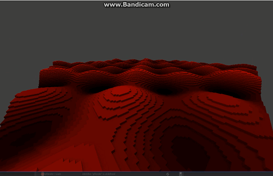
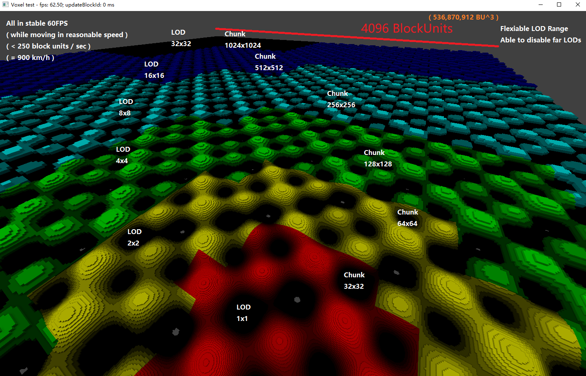
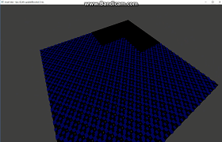

# GLPlayground
Ananannother happy happy playground >w☆（kira

The low-level APIs are just tooooooooo annoying... (Vulkan DX12 etc.)  
They are F&^@$KING my brain...  
I need warm warm OpenGL to play with lol  

## CS_Voxel Drawer
A simple voxel engine that uses compute shader to render the voxels.  
here is an animated GIF:  

Block Count = (10 x 10) x (32 x 32 x 32) = 320 (X) x 32 (Y) x 320 (Z)

It gets ~100FPS on my Razer 2017 ( GTX1060 6GB - 7700HQ - 16GB RAM ),  
and gets ~140FPS on my desktop in my lab ( 1 of 3x GTX TITAN X 12GB - 5960X - 32GB RAM ).

**It also has a LOD system based on Octrees:**  

**Compile**  
dep_glew_glfw_glut.zip was compiled for Visual Studio 2015 x64.  
You need extract that zip file in root folder. (**NOT** something like dep_glew_glfw_glut/...)  
If you have other compilers, maybe you need complie those librarys from their own source.  
you may need copy the .dll s from glut/bin and glew/bin.

**Comments**  
GPU computes meshes of each chunk.
